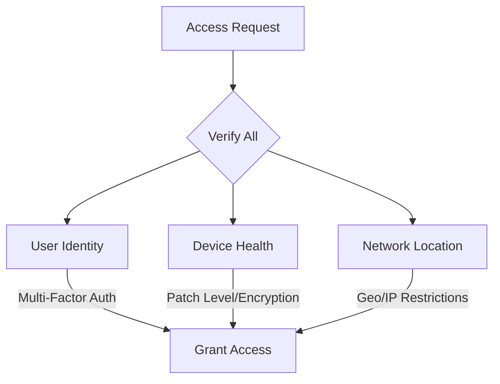

### 🔒 Zero Trust Access Flow
"Never trust, always verify" security model


### 🌐 Microsoft Entra App Gallery  
*Safe business app store with Microsoft verification*

```mermaid
graph LR
    A[Developer]-->B{Microsoft Check}
    B-->|Approved|C[(Gallery)]
    B-->|Rejected|D[Fix]
    C-->E[Internal Use]
    C-->F[Public Sale]
