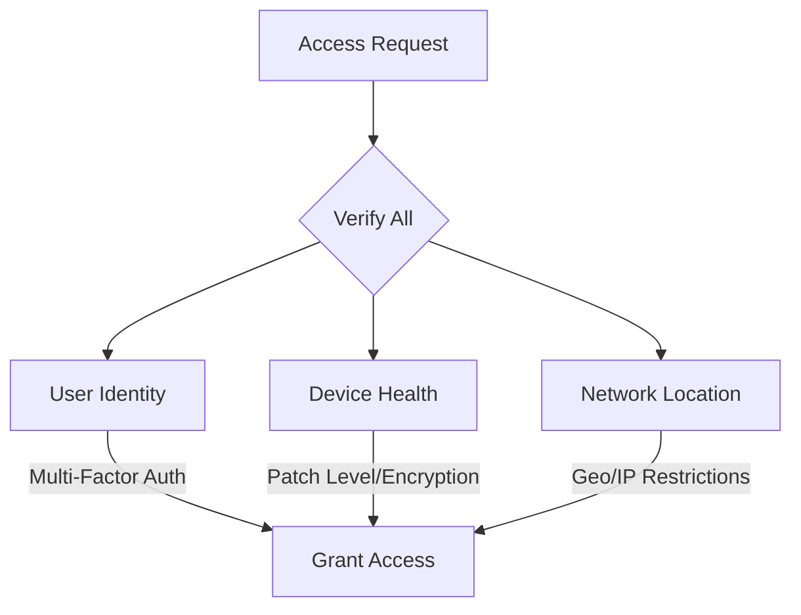
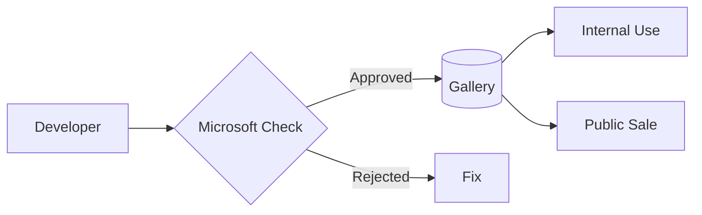
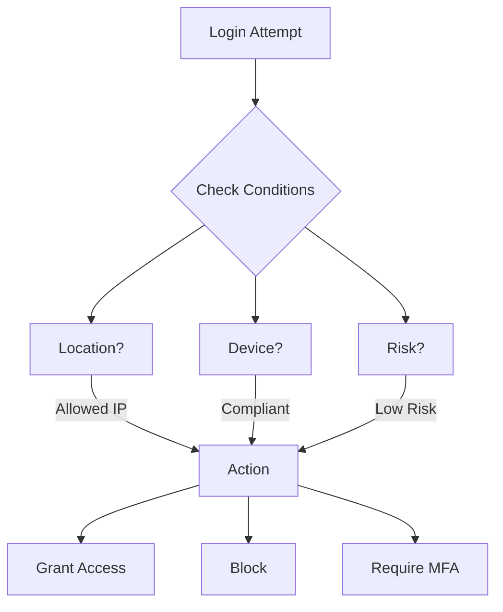

## 🔒 Zero Trust Access Flow
*"Never trust, always verify" security model that checks every access request like a strict bouncer*

## 🌐 Microsoft Entra App Gallery  
*Centralized enterprise app store where Microsoft pre-verifies business applications for security and compatibility. you can sell app to other enterprise or you can keep your app for interne only*

## 🛡️ Conditional Access (Microsoft Entra ID)  
Automatically enforces security rules before granting access to resources.

## Administrative unit:

